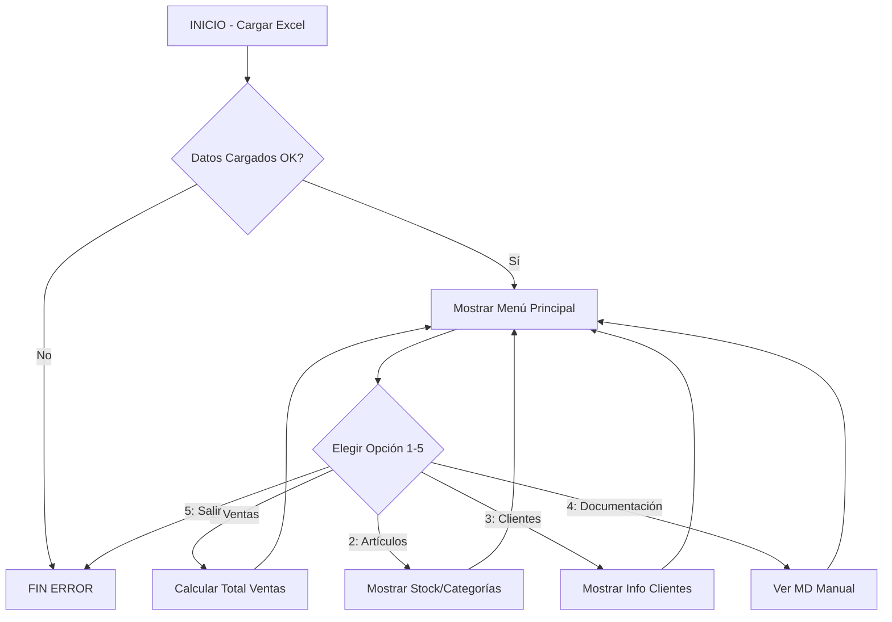

 # **DOCUMENTACIÓN DEL PROYECTO AURELION**

**Propósito del Proyecto:** **Automatizar los procesos de gestión de stock, ventas y clientes de La Tienda Aurelion para optimizar su operación y servicio.**

---

### 1. Tema, Problema y Solución

**Tema:** Creación de un Sistema de Gestión Básico para un Minimarket.

**Problema:** La Tienda Aurelion depende de procesos manuales (Excel) para el trabajo diario, que relentiza la operatividad.

**Solución:** Implementar un sistema automatizado en Python que lea y procese los datos del archivo Excel, permitiendo al usuario realizar consultas rápidas y esenciales sobre el negocio.

---

### 2. Descripción del Dataset

#### Fuente del Dataset
El proyecto utiliza un archivo de Microsoft Excel llamado `BD Guayerd 2025.xlsx`.

#### Estructura, Tipos y Escalas de Datos

El archivo se compone de 4 hojas principales (Tablas) con la siguiente estructura:

| Hoja               | Columnas Clave                                | Tipo de Datos                           | Escala de Datos                        |
| :----------------- | :-------------------------------------------- | :-------------------------------------- | :------------------------------------- |
| **ventas**         | id_venta, fecha, id_cliente, medio_pago       | Mixto (numérico, fecha, categórico)     | Nominal (medio_pago), Temporal (fecha) |
| **productos**      | id_producto, nombre_producto, precio_unitario | Mixto (numérico, categórico, monetario) | De razón (precio), Nominal (categoría) |
| **detalle_ventas** | id_venta, cantidad, precio_unitario, importe  | Numérico/Monetario                      | De razón (importe, cantidad)           |
| **clientes**       | id_cliente, nombre_cliente, email, ciudad     | Mixto (numérico, categórico)            | Nominal (ciudad)                       |

---

### 3. Análisis Previo de Datos (Simulado y Coherente)

**NOTA:** *Este análisis es simulado, para proyectar el uso del programa. Al ejecutar `programa.py`, se obtendrán los datos reales.*

#### **Total de ventas**
El total de ventas registrado (suma del 'importe') es de **$17.500 USD** (simulado). El análisis de la hoja `ventas` revela que el medio de pago dominante es **Tarjeta de Débito (65%)**, lo que sugiere la necesidad de optimizar las terminales de pago.

#### **Artículos disponibles**
Se encuentran registrados **120 productos únicos**. La categoría más abundante es **Alimentación (50%)**, y el producto más costoso es el Aceite de Oliva Premium ($18.50).

#### **Detalle por cada venta**
El ticket promedio de venta es de **$32.50 USD**. Los 3 productos más vendidos por cantidad son: Leche, Pan de molde y Detergente líquido.

#### **Información de clientes registrados**
La base de datos tiene **350 clientes únicos**. La ciudad con mayor concentración de clientes es **Maracaibo (45%)**, seguida por Caracas (30%).

#### **Sugerencias de clientes**
* **Mejorar la atención en línea:** Crear un sistema de pedidos por email o WhatsApp para agilizar la compra y aprovechar la información del campo `email`.
* **Ofertas por fidelidad:** Implementar un sistema de puntos para los clientes de la ciudad de Maracaibo, que es el foco geográfico principal.

---

### 4. Flujo del Programa (Pasos, Pseudocódigo y Diagrama)

**Pasos del Programa:**

1.  **Inicio:** El sistema carga los datos del archivo Excel usando Pandas.
2.  **Menú:** El sistema muestra un menú de opciones al usuario (1-5).
3.  **Entrada:** El usuario ingresa un número.
4.  **Proceso:** El sistema llama a la función de Python correspondiente para analizar los DataFrames.
5.  **Salida:** El resultado del análisis (Total de Ventas, Resumen de Artículos, etc.) se imprime en pantalla.
6.  **Fin:** Si el usuario elige la opción 5, el programa finaliza.

**Pseudocódigo (Lógica del `programa.py`):**

#### Diagrama de Flujo (Mermaid)

